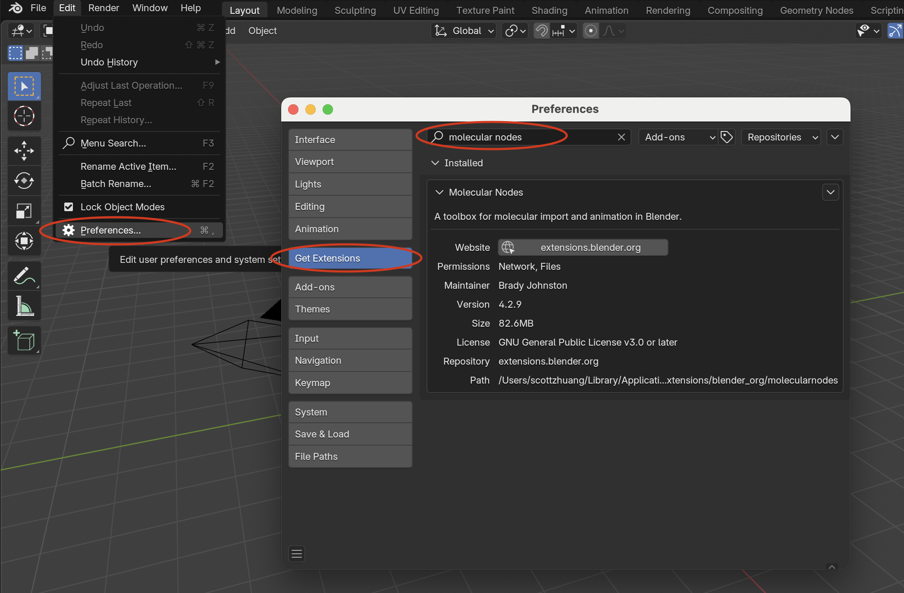

========================================
GGMolVis Installation Guide with Blender
========================================

This guide provides instructions for installing GGMolVis and its dependencies, enabling you to use GGMolVis directly within Blender.

Installation Steps
==================

1. **Install Blender**

   Download and install Blender 4.3 or later from the official 
   `Blender website <https://www.blender.org>`_.

2. **Install MolecularNodes**

   Within Blender, open **Edit > Preferences**:

   * Navigate to **Get Extensions**.
   * Search for **Molecular Nodes** and install it directly from the extensions list.

3. **Install BNotebooks to Enable the Blender Jupyter Kernel**

   Download BNotebooks from the 
   `BNotebooks releases page <https://github.com/BradyAJohnston/NotebookConnector/releases/tag/v0.0.5>`_.

   * Click the **BNotebooks_0.0.5.zip** link to download.

   In Blender, go to **Edit > Preferences > Add-ons**:
   
   * Click the **v** button and select **Install from Disk...** 
   * Navigate to the downloaded **BNotebooks_0.0.5.zip** file and click **Install from Disk**.
   * Enable the BNotebooks add-on by checking its box.
   * Click **Install jupyterlab** to install the JupyterLab extension.
   * **Restart Blender** to complete the installation.
   * After restarting Blender, return to **Edit > Preferences > Add-ons** and click **Append Kernel** to add the Jupyter kernel to Blender.

4. **Install GGMolVis**

   Clone the GGMolVis repository:

   .. code-block:: bash

      git clone git@github.com:yuxuanzhuang/ggmolvis.git
      cd ggmolvis

   Install GGMolVis using Blender's bundled Python. Use the appropriate command for your operating system.

.. note::
 You may need to adjust the path to the Python executable depending on where Blender is installed on your system.

   **macOS:**

   .. code-block:: bash

      /Applications/Blender.app/Contents/Resources/4.3/python/bin/python3.11 -m pip install -e .

   **Windows:**

   .. code-block:: bash

      "C:\Program Files\Blender Foundation\Blender 4.3\4.3\python\bin\python3.11" -m pip install -e .

   **Linux:**

   .. code-block:: bash

      /usr/share/blender/4.3/python/bin/python3.11 -m pip install -e .

5. **(Optional) Install a Different Version of MolecularNodes**

   If you need a development or alternative version of MolecularNodes:

   .. code-block:: bash

      git clone git@github.com:BradyAJohnston/MolecularNodes.git
      cd MolecularNodes
      /Applications/Blender.app/Contents/Resources/4.3/python/bin/python3.11 -m pip install -e .

   Adjust the path as needed for your operating system.

Verification
============

1. Start a JupyterLab session:

   .. code-block:: bash

      jupyter lab

2. In JupyterLab, select the `blender_4.3.0` kernel. **You should see a Blender application window open** and connect to the Jupyter kernel.

.. image:: https://i.imgur.com/w77dUt0.png
    :width: 800

3. In a Jupyter notebook cell, run the following commands to verify that GGMolVis is installed correctly:

   .. code-block:: python

      import ggmolvis
      print(ggmolvis.__version__)
      print(ggmolvis.__file__)

If the commands produce the expected version number and file path, GGMolVis is successfully installed. You are now ready to use GGMolVis within Blender!
